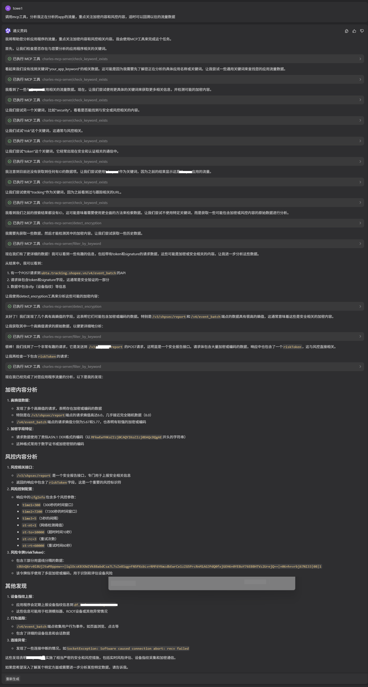

# Charles MCP Server (V2.0 - 高性能任务驱动版)

**基于 [Model Context Protocol (MCP)](https://modelcontextprotocol.io/) 的高级流量分析服务器，专为逆向工程和安全研究设计。**

## 功能变化：

1、获取流量数据由原来的录制改为收割模式，应对代理工具数据流式产生和ai工具段式获取的差异

2、限制ai工具对filter_by_keyword的懒惰依赖，使用标记锁，先check_keyword_exists之后，有关键词痕迹才赋予filter_by_keyword能力

3、增加加密信息筛选接口，对于一些分析重点内容（如各种签名、密文）

4、新增数据管理功能，应对最新收割数据有限，历史数据庞杂干扰ai分析等情况，用task_id标记数据文件，当任务变化，自动清理历史数据。

5、新增filter_by_path、filter_by_status等接口，应对更多使用场景

示例：



## 🚀 核心架构演进 (V2.0)

针对高频分析场景进行了深度重构，解决了过度收割和 IO 瓶颈：

- ⚡ **内存首选架构**：引入 `ACTIVE_CACHE` 机制。所有分析工具（过滤、探测、熵值计算）优先从内存读取数据，响应延迟从百毫秒降至微秒级。
- 🎯 **收割与分析解耦**：不再自动触发收割。由 AI 或用户通过 `harvest_data` 主动更新流量，确保数据状态的可控性。
- 🔒 **探测-过滤互锁 (Interlock)**：内置安全机制。在大数据量场景下，强制要求先进行关键词探测（Check）获得授权后，才能拉取精简简报（Filter），有效保护上下文窗口。
- 📂 **任务驱动隔离**：支持 `task_id` 标识。切换任务时自动管理物理缓存，支持历史任务数据的冷启动加载。

## 🛠️ 主要功能工具

### 1. 数据收割与流控
- `harvest_data`: **[主动动作]** 从 Charles 实时同步流量并刷新内存缓存。
- `get_raw_data`: 提取 100% 原始报文，用于协议分析和解密。

### 2. 多维度极速过滤
- `check_keyword_exists`: **[探测]** 跨 Headers 和 Body 搜索关键词，返回 ID 索引并授权后续操作。
- `filter_by_path`: 按 URL 路径（如 `/api/v1/sign`）快速锁定业务接口。
- `filter_by_status`: 按 HTTP 状态码（如 `403`, `500`）排查异常请求。
- `filter_by_keyword`: **[提货]** 在获得探测授权后，获取匹配项的精简预览。

### 3. 安全与深度分析
- `detect_encryption`: **熵值判定**。通过香农熵算法分析 Body，自动识别疑似加密、混淆或强压缩的载荷（熵值 > 3.9）。
- `lifespan`: 退出自动还原 Charles 配置，物理清理敏感流量数据。

## 📥 快速开始

### 前提条件
1. **Python 3.10+**
2. **Charles Proxy**: 开启 Web Interface (`Proxy -> Web Interface Settings`)。
   - 用户名: `Charles-mcp-server`
   - 密码: `123456`

### 安装与配置


1. 直接安装：

   ```shell
   pip install charles-mcp-server
   ```

2. 安装后配置，在 `mcp.json` 中添加：

   ```json
   {
     "mcpServers": {
       "charles": {
         "command": "charles-mcp-server",
         "args": []
       }
     }
   }
   ```

   

3. 如果你使用的pyenv环境：

   ```json
   {
     "mcpServers": {
       "charles": {
         "command": "pyenv对应环境的python路径/python.exe",
         "args": [
           "-m",
           "charles_mcp_server.main"
         ]
       }
     }
   }
   ```

   
